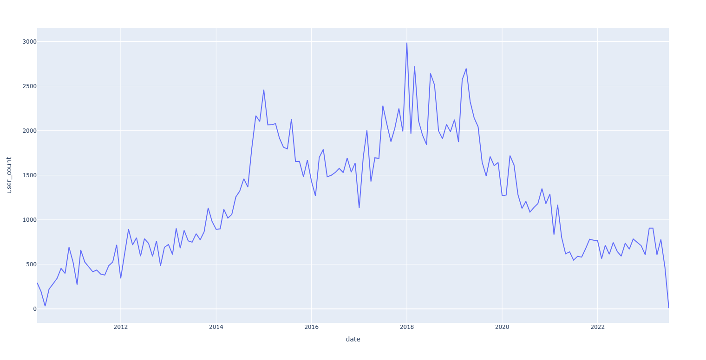
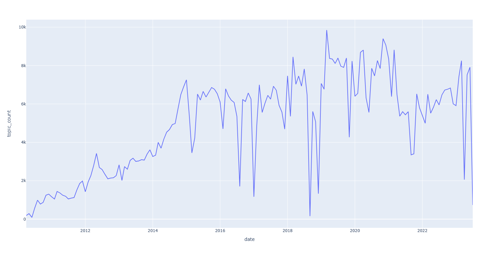
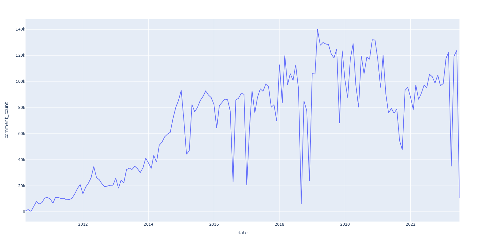

# 一个爬取v2ex.com网站的爬虫

学习scrapy写的一个小爬虫

数据都放在了sqlite数据库，方便分享，整个数据库大小2.1GB。

在GitHub我 release 了完整的sqlite数据库文件

## 不建议自行运行爬虫，数据已经有了

爬取花了几十小时，因为爬快了会封禁IP，并且我也没使用代理池。并发数设置为3基本上可以一直爬。

[下载数据库](https://github.com/oldshensheep/v2ex_scrapy/releases)

## 爬取相关数据说明

爬虫从`topic_id = 1`开始爬，路径为`https://www.v2ex.com/t/{topic_id}`。 服务器可能返回404/403/302/200，如果是404说明帖子被删除了，如果是403说明是爬虫被限制了，302一般是跳转到登陆页面，有的也是跳转到主页，200返回正常页面。

爬虫没有登陆，所以爬取的数据不完全，比如水下火热的帖子就没有爬到，还有就是如果是302的帖子会记录帖子id，404/403不会记录。

爬取过程中会帖子内容，评论，以及评论的用户信息。

注1：爬了一半才发现V站帖子附言没有爬，附言从`topic_id = 448936`才会爬取

注2：select count(*) from member 得到的用户数比较小，大概20W，是因为爬取过程中是根据评论，以及发帖信息爬取用户的，如果一个用户注册之后既没有评论也没有发帖，那么这个账号就爬不到。还有就是因为部分帖子访问不了，也可能导致部分账号没有爬。还有部分用户号被删除，这一部分也没有爬。（代码改了，可以爬，但是都已经爬完了……）

注3：时间均为UTC+0的秒数

注4：数据库除了主键，和唯一索引，没有加其他索引。

## 运行

确保python >=3.10

### 安装依赖

```bash
pip install -r .\requirements.txt
```

### 配置

#### 代理

更改 `v2ex_scrapy/settings.py` 中 `PROXIES`的值 如

```python
[
     "http://127.0.0.1:7890"
]
```

请求会随机选择一个代理，如果需要更高级的代理方式可以使用第三方库，或者自行实现Middleware

#### LOG

默认关闭了写入Log文件的功能，如需开启修改`v2ex_scrapy\settings.py`中的这行`# LOG_FILE = "v2ex_scrapy.log"`配置文件，取消注释

### 运行爬虫

```bash
scrapy crawl v2ex
```

> `scrapy: command not found` 说明没有添加python包的安装位置到环境变量

### 接着上次爬

直接运行爬取的命令即可，会自动继续爬。

原理就是查询数据库中最大的topic_id，然后从topic_id开始爬。

```bash
scrapy crawl v2ex
```

### 注意事项

爬取过程中出现403基本上是因为IP被限制了，等待一段时间即可

## 统计分析

统计用的SQL在[query.sql](query.sql)这个文件下，图表的源码在[analysis.py](analysis.py)

### 帖子、评论和用户数量统计

帖子总数：801,038 （80万）  
评论总数：10,899,382 （1000万）  
用户总数：194,534 （20万）异常原因见爬取相关数据说明的注2  

### 获得感谢最多的评论

因为部分评论内容较多不方便展示，要查看内容可以点击链接。或者下载数据库使用SQL查询，SQL查询文件也包含在开源文件中

| 评论链接 | 感谢数 |
| :--- | :--- |
| [https://www.v2ex.com/t/820687#r_11150263](https://www.v2ex.com/t/820687#r_11150263) | 316 |
| [https://www.v2ex.com/t/437760#r_5432223](https://www.v2ex.com/t/437760#r_5432223) | 297 |
| [https://www.v2ex.com/t/915584#r_12684442](https://www.v2ex.com/t/915584#r_12684442) | 248 |
| [https://www.v2ex.com/t/917858#r_12720322](https://www.v2ex.com/t/917858#r_12720322) | 246 |
| [https://www.v2ex.com/t/949195#r_13227124](https://www.v2ex.com/t/949195#r_13227124) | 246 |
| [https://www.v2ex.com/t/881410#r_12126164](https://www.v2ex.com/t/881410#r_12126164) | 245 |
| [https://www.v2ex.com/t/884719#r_12178891](https://www.v2ex.com/t/884719#r_12178891) | 240 |
| [https://www.v2ex.com/t/901263#r_12442916](https://www.v2ex.com/t/901263#r_12442916) | 240 |
| [https://www.v2ex.com/t/749163#r_10129442](https://www.v2ex.com/t/749163#r_10129442) | 217 |
| [https://www.v2ex.com/t/877829#r_12070911](https://www.v2ex.com/t/877829#r_12070911) | 216 |

### 正向投票最多的帖子

| 帖子链接 | 标题 | 票数 |
| :--- | :--- | :--- |
| [https://www.v2ex.com/t/110327](https://www.v2ex.com/t/110327) | UP n DOWN vote in V2EX | 321 |
| [https://www.v2ex.com/t/295433](https://www.v2ex.com/t/295433) | Snipaste - 开发了三年的截图工具，但不只是截图 | 274 |
| [https://www.v2ex.com/t/462641](https://www.v2ex.com/t/462641) | 在 D 版发过了，不过因为不少朋友看不到 D 版，我就放在这里吧，说说我最近做的这个 Project | 200 |
| [https://www.v2ex.com/t/658387](https://www.v2ex.com/t/658387) | 剽窃别人成果的人一直有，不过今天遇到了格外厉害的 | 179 |
| [https://www.v2ex.com/t/745030](https://www.v2ex.com/t/745030) | QQ 正在尝试读取你的浏览记录 | 177 |
| [https://www.v2ex.com/t/689296](https://www.v2ex.com/t/689296) | 早上还在睡觉，自如管家进了我卧室... | 145 |
| [https://www.v2ex.com/t/814025](https://www.v2ex.com/t/814025) | 分享一张我精心修改调整的 M42 猎户座大星云(Orion Nebula)壁纸。用了非常多年，首次分享出来，能和 MBP 2021 新屏幕和谐相处。 | 136 |
| [https://www.v2ex.com/t/511827](https://www.v2ex.com/t/511827) | 23 岁，得了癌症，人生无望 | 129 |
| [https://www.v2ex.com/t/427796](https://www.v2ex.com/t/427796) | 隔壁组的小兵集体情愿 要炒了 team leader | 123 |
| [https://www.v2ex.com/t/534800](https://www.v2ex.com/t/534800) | 使用 Github 账号登录 黑客派 之后， Github 自动 follow | 112 |

### 点击次数最多的帖子

| 帖子链接 | 标题 | 点击数 |
| :--- | :--- | :--- |
| [https://www.v2ex.com/t/510849](https://www.v2ex.com/t/510849) | chrome 签到插件 \[魂签\] 更新啦 | 39,452,510 |
| [https://www.v2ex.com/t/706595](https://www.v2ex.com/t/706595) | 迫于搬家 ··· 继续出 700 本书\~ 四折 非技术书还剩 270 多本· | 2,406,584 |
| [https://www.v2ex.com/t/718092](https://www.v2ex.com/t/718092) | 使用 GitHub 的流量数据为仓库创建访问数和克隆数的徽章 | 1,928,267 |
| [https://www.v2ex.com/t/861832](https://www.v2ex.com/t/861832) | 帮朋友推销下福建古田水蜜桃，欢迎各位购买啊 | 635,832 |
| [https://www.v2ex.com/t/176916](https://www.v2ex.com/t/176916) | 王垠这是在想不开吗 | 329,617 |
| [https://www.v2ex.com/t/303889](https://www.v2ex.com/t/303889) | 关于 V2EX 提供的 Android Captive Portal Server 地址的更新 | 295,681 |
| [https://www.v2ex.com/t/206766](https://www.v2ex.com/t/206766) | 如何找到一些有趣的 telegram 群组？ | 294,553 |
| [https://www.v2ex.com/t/265474](https://www.v2ex.com/t/265474) | ngrok 客户端和服务端如何不验证证书 | 271,244 |
| [https://www.v2ex.com/t/308080](https://www.v2ex.com/t/308080) | Element UI——一套基于 Vue 2.0 的桌面端组件库 | 221,099 |
| [https://www.v2ex.com/t/295433](https://www.v2ex.com/t/295433) | Snipaste - 开发了三年的截图工具，但不只是截图 | 210,675 |

### 发送评论最多的用户

| 用户 | 评论数 |
| :--- | :--- |
| [Livid](https://www.v2ex.com/member/Livid) | 19559 |
| [loading](https://www.v2ex.com/member/loading) | 19190 |
| [murmur](https://www.v2ex.com/member/murmur) | 17189 |
| [msg7086](https://www.v2ex.com/member/msg7086) | 16768 |
| [Tink](https://www.v2ex.com/member/Tink) | 15919 |
| [imn1](https://www.v2ex.com/member/imn1) | 11468 |
| [20015jjw](https://www.v2ex.com/member/20015jjw) | 10293 |
| [x86](https://www.v2ex.com/member/x86) | 9704 |
| [opengps](https://www.v2ex.com/member/opengps) | 9694 |
| [est](https://www.v2ex.com/member/est) | 9532 |

### 发送帖子最多的用户

| 用户 | 主题数 |
| :--- | :--- |
| [Livid](https://www.v2ex.com/member/Livid) | 6974 |
| [icedx](https://www.v2ex.com/member/icedx) | 722 |
| [ccming](https://www.v2ex.com/member/ccming) | 646 |
| [2232588429](https://www.v2ex.com/member/2232588429) | 614 |
| [razios](https://www.v2ex.com/member/razios) | 611 |
| [coolair](https://www.v2ex.com/member/coolair) | 604 |
| [Kai](https://www.v2ex.com/member/Kai) | 599 |
| [est](https://www.v2ex.com/member/est) | 571 |
| [Newyorkcity](https://www.v2ex.com/member/Newyorkcity) | 553 |
| [WildCat](https://www.v2ex.com/member/WildCat) | 544 |

## 曲线

需要详细的数据，建议下载数据库

### 每月新用户数折线图



### 每月新帖子数折线图



### 评论数折线图



### 使用次数最多的节点

| 节点 | 次数 |
| :--- | :--- |
| [qna](https://www.v2ex.com/go/qna) | 188011 |
| [all4all](https://www.v2ex.com/go/all4all) | 103254 |
| [programmer](https://www.v2ex.com/go/programmer) | 51706 |
| [jobs](https://www.v2ex.com/go/jobs) | 49959 |
| [share](https://www.v2ex.com/go/share) | 35942 |
| [apple](https://www.v2ex.com/go/apple) | 20713 |
| [macos](https://www.v2ex.com/go/macos) | 19040 |
| [create](https://www.v2ex.com/go/create) | 18685 |
| [python](https://www.v2ex.com/go/python) | 14124 |
| [career](https://www.v2ex.com/go/career) | 13170 |

### 使用次数最多的tag （tag为v2ex自动生成）

| tag | 次数 |
| :--- | :--- |
| [开发](https://www.v2ex.com/tag/%E5%BC%80%E5%8F%91) | 16414 |
| [App](https://www.v2ex.com/tag/App) | 13240 |
| [Python](https://www.v2ex.com/tag/Python) | 13016 |
| [Mac](https://www.v2ex.com/tag/Mac) | 12931 |
| [Java](https://www.v2ex.com/tag/Java) | 10984 |
| [Pro](https://www.v2ex.com/tag/Pro) | 9375 |
| [iOS](https://www.v2ex.com/tag/iOS) | 9216 |
| [微信](https://www.v2ex.com/tag/%E5%BE%AE%E4%BF%A1) | 8922 |
| [V2EX](https://www.v2ex.com/tag/V2EX) | 8426 |
| [域名](https://www.v2ex.com/tag/%E5%9F%9F%E5%90%8D) | 8424 |
